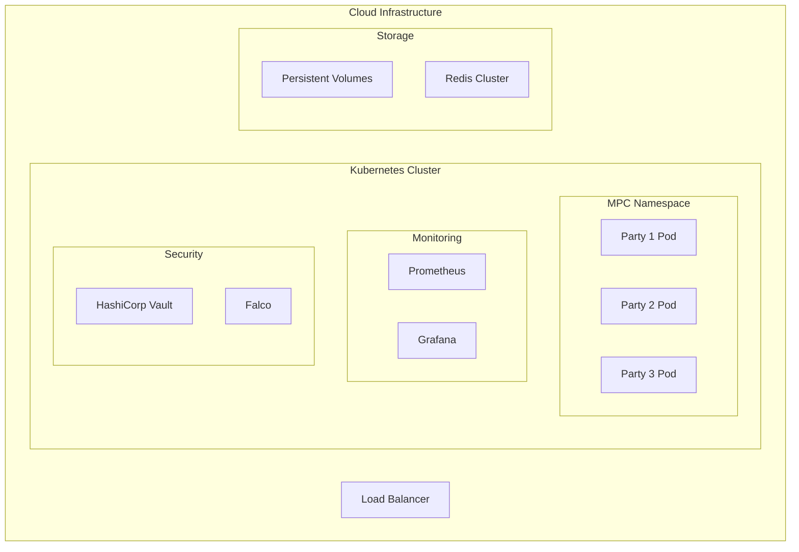

# Infrastructure as Code for Secure MPC Transformer

## Overview

This document provides Infrastructure as Code (IaC) templates and configurations for deploying the Secure MPC Transformer in production environments with security-first practices.

## Architecture Overview



## Terraform Infrastructure

### 1. Provider Configuration

```hcl
# terraform/providers.tf
terraform {
  required_version = ">= 1.0"
  required_providers {
    google = {
      source  = "hashicorp/google"
      version = "~> 4.0"
    }
    kubernetes = {
      source  = "hashicorp/kubernetes"
      version = "~> 2.0"
    }
    helm = {
      source  = "hashicorp/helm"
      version = "~> 2.0"
    }
  }
  
  backend "gcs" {
    bucket = "secure-mpc-terraform-state"
    prefix = "terraform/state"
  }
}

provider "google" {
  project = var.project_id
  region  = var.region
}

provider "kubernetes" {
  host                   = "https://${google_container_cluster.primary.endpoint}"
  token                  = data.google_client_config.provider.access_token
  cluster_ca_certificate = base64decode(google_container_cluster.primary.master_auth.0.cluster_ca_certificate)
}
```

### 2. GKE Cluster Configuration

```hcl
# terraform/gke.tf
resource "google_container_cluster" "primary" {
  name     = "${var.cluster_name}-cluster"
  location = var.region
  
  # Security hardening
  remove_default_node_pool = true
  initial_node_count       = 1
  
  # Network policy for micro-segmentation
  network_policy {
    enabled = true
  }
  
  # Private cluster configuration
  private_cluster_config {
    enable_private_nodes    = true
    enable_private_endpoint = false
    master_ipv4_cidr_block = "172.16.0.0/28"
  }
  
  # IP allocation for pods and services
  ip_allocation_policy {
    cluster_ipv4_cidr_block  = "10.1.0.0/16"
    services_ipv4_cidr_block = "10.2.0.0/16"
  }
  
  # Master authorized networks
  master_authorized_networks_config {
    cidr_blocks {
      cidr_block   = var.authorized_network_cidr
      display_name = "Authorized Network"
    }
  }
  
  # Security configurations
  workload_identity_config {
    workload_pool = "${var.project_id}.svc.id.goog"
  }
  
  # Binary authorization
  binary_authorization {
    evaluation_mode = "PROJECT_SINGLETON_POLICY_ENFORCE"
  }
  
  # Logging and monitoring
  logging_service    = "logging.googleapis.com/kubernetes"
  monitoring_service = "monitoring.googleapis.com/kubernetes"
  
  # Network configuration
  network    = google_compute_network.vpc.name
  subnetwork = google_compute_subnetwork.subnet.name
  
  # Maintenance window
  maintenance_policy {
    daily_maintenance_window {
      start_time = "03:00"
    }
  }
}

resource "google_container_node_pool" "gpu_nodes" {
  name       = "gpu-node-pool"
  location   = var.region
  cluster    = google_container_cluster.primary.name
  node_count = var.gpu_node_count
  
  node_config {
    preemptible  = false
    machine_type = "n1-standard-4"
    
    # GPU configuration
    guest_accelerator {
      type  = "nvidia-tesla-t4"
      count = 1
    }
    
    # Security configurations
    service_account = google_service_account.gke_node_sa.email
    oauth_scopes = [
      "https://www.googleapis.com/auth/cloud-platform"
    ]
    
    # Node hardening
    shielded_instance_config {
      enable_secure_boot          = true
      enable_integrity_monitoring = true
    }
    
    # Container runtime
    image_type = "COS_CONTAINERD"
    
    # Disk configuration
    disk_type    = "pd-ssd"
    disk_size_gb = 100
    
    # Labels and taints
    labels = {
      role = "mpc-compute"
      gpu  = "nvidia-t4"
    }
    
    taint {
      key    = "gpu-node"
      value  = "true"
      effect = "NO_SCHEDULE"
    }
  }
  
  # Auto-scaling
  autoscaling {
    min_node_count = 1
    max_node_count = var.max_gpu_nodes
  }
  
  # Auto-upgrade and auto-repair
  management {
    auto_repair  = true
    auto_upgrade = true
  }
}

resource "google_container_node_pool" "cpu_nodes" {
  name       = "cpu-node-pool"
  location   = var.region
  cluster    = google_container_cluster.primary.name
  node_count = var.cpu_node_count
  
  node_config {
    preemptible  = true
    machine_type = "n1-standard-2"
    
    service_account = google_service_account.gke_node_sa.email
    oauth_scopes = [
      "https://www.googleapis.com/auth/cloud-platform"
    ]
    
    shielded_instance_config {
      enable_secure_boot          = true
      enable_integrity_monitoring = true
    }
    
    image_type = "COS_CONTAINERD"
    
    disk_type    = "pd-standard"
    disk_size_gb = 50
    
    labels = {
      role = "mpc-coordination"
    }
  }
  
  autoscaling {
    min_node_count = 1
    max_node_count = var.max_cpu_nodes
  }
  
  management {
    auto_repair  = true
    auto_upgrade = true
  }
}
```

### 3. Networking Configuration

```hcl
# terraform/network.tf
resource "google_compute_network" "vpc" {
  name                    = "${var.cluster_name}-vpc"
  auto_create_subnetworks = false
}

resource "google_compute_subnetwork" "subnet" {
  name          = "${var.cluster_name}-subnet"
  ip_cidr_range = "10.0.0.0/24"
  region        = var.region
  network       = google_compute_network.vpc.id
  
  # Enable flow logs for security monitoring
  log_config {
    aggregation_interval = "INTERVAL_10_MIN"
    flow_sampling        = 0.5
    metadata            = "INCLUDE_ALL_METADATA"
  }
  
  secondary_ip_range {
    range_name    = "pods"
    ip_cidr_range = "10.1.0.0/16"
  }
  
  secondary_ip_range {
    range_name    = "services"
    ip_cidr_range = "10.2.0.0/16"
  }
}

# Firewall rules
resource "google_compute_firewall" "allow_internal" {
  name    = "${var.cluster_name}-allow-internal"
  network = google_compute_network.vpc.name
  
  allow {
    protocol = "tcp"
  }
  
  allow {
    protocol = "udp"
  }
  
  allow {
    protocol = "icmp"
  }
  
  source_ranges = ["10.0.0.0/8"]
}

resource "google_compute_firewall" "allow_mpc_communication" {
  name    = "${var.cluster_name}-allow-mpc"
  network = google_compute_network.vpc.name
  
  allow {
    protocol = "tcp"
    ports    = ["50051", "50052", "50053"]  # gRPC ports for MPC
  }
  
  source_tags = ["mpc-node"]
  target_tags = ["mpc-node"]
}
```

### 4. Security and Secrets Management

```hcl
# terraform/security.tf
resource "google_service_account" "gke_node_sa" {
  account_id   = "${var.cluster_name}-node-sa"
  display_name = "GKE Node Service Account"
}

resource "google_project_iam_member" "gke_node_sa_roles" {
  for_each = toset([
    "roles/logging.logWriter",
    "roles/monitoring.metricWriter",
    "roles/monitoring.viewer",
    "roles/storage.objectViewer"
  ])
  
  project = var.project_id
  role    = each.value
  member  = "serviceAccount:${google_service_account.gke_node_sa.email}"
}

# KMS for encryption
resource "google_kms_key_ring" "mpc_keyring" {
  name     = "${var.cluster_name}-keyring"
  location = var.region
}

resource "google_kms_crypto_key" "mpc_key" {
  name     = "mpc-encryption-key"
  key_ring = google_kms_key_ring.mpc_keyring.id
  
  lifecycle {
    prevent_destroy = true
  }
  
  version_template {
    algorithm = "GOOGLE_SYMMETRIC_ENCRYPTION"
  }
}

# Binary Authorization Policy
resource "google_binary_authorization_policy" "policy" {
  admission_whitelist_patterns {
    name_pattern = "gcr.io/${var.project_id}/*"
  }
  
  default_admission_rule {
    evaluation_mode  = "REQUIRE_ATTESTATION"
    enforcement_mode = "ENFORCED_BLOCK_AND_AUDIT_LOG"
    
    require_attestations_by = [
      google_binary_authorization_attestor.attestor.name
    ]
  }
}

resource "google_binary_authorization_attestor" "attestor" {
  name = "mpc-attestor"
  
  attestation_authority_note {
    note_reference = google_container_analysis_note.note.name
    
    public_keys {
      ascii_armored_pgp_public_key = var.pgp_public_key
    }
  }
}
```

## Kubernetes Manifests

### 1. Namespace and RBAC

```yaml
# k8s/namespace.yaml
apiVersion: v1
kind: Namespace
metadata:
  name: secure-mpc
  labels:
    name: secure-mpc
    security.policy: restricted
---
apiVersion: v1
kind: ServiceAccount
metadata:
  name: mpc-service-account
  namespace: secure-mpc
  annotations:
    iam.gke.io/gcp-service-account: mpc-gsa@PROJECT_ID.iam.gserviceaccount.com
---
apiVersion: rbac.authorization.k8s.io/v1
kind: Role
metadata:
  namespace: secure-mpc
  name: mpc-role
rules:
- apiGroups: [""]
  resources: ["pods", "services", "configmaps", "secrets"]
  verbs: ["get", "list", "watch"]
- apiGroups: ["apps"]
  resources: ["deployments", "statefulsets"]
  verbs: ["get", "list", "watch"]
---
apiVersion: rbac.authorization.k8s.io/v1
kind: RoleBinding
metadata:
  name: mpc-role-binding
  namespace: secure-mpc
subjects:
- kind: ServiceAccount
  name: mpc-service-account
  namespace: secure-mpc
roleRef:
  kind: Role
  name: mpc-role
  apiGroup: rbac.authorization.k8s.io
```

### 2. Network Policies

```yaml
# k8s/network-policy.yaml
apiVersion: networking.k8s.io/v1
kind: NetworkPolicy
metadata:
  name: mpc-network-policy
  namespace: secure-mpc
spec:
  podSelector:
    matchLabels:
      app: secure-mpc
  policyTypes:
  - Ingress
  - Egress
  
  ingress:
  - from:
    - podSelector:
        matchLabels:
          app: secure-mpc
    ports:
    - protocol: TCP
      port: 50051
    - protocol: TCP
      port: 8080
  
  egress:
  - to:
    - podSelector:
        matchLabels:
          app: secure-mpc
    ports:
    - protocol: TCP
      port: 50051
  - to: []  # Allow DNS
    ports:
    - protocol: UDP
      port: 53
  - to:
    - podSelector:
        matchLabels:
          app: redis
    ports:
    - protocol: TCP
      port: 6379
```

### 3. MPC Node StatefulSet

```yaml
# k8s/mpc-statefulset.yaml
apiVersion: apps/v1
kind: StatefulSet
metadata:
  name: mpc-nodes
  namespace: secure-mpc
spec:
  serviceName: mpc-service
  replicas: 3
  selector:
    matchLabels:
      app: secure-mpc
  
  template:
    metadata:
      labels:
        app: secure-mpc
        role: mpc-compute
      annotations:
        container.apparmor.security.beta.kubernetes.io/mpc-container: runtime/default
    
    spec:
      serviceAccountName: mpc-service-account
      
      # Security context
      securityContext:
        runAsNonRoot: true
        runAsUser: 1000
        runAsGroup: 1000
        fsGroup: 1000
        seccompProfile:
          type: RuntimeDefault
      
      # Pod anti-affinity for high availability
      affinity:
        podAntiAffinity:
          requiredDuringSchedulingIgnoredDuringExecution:
          - labelSelector:
              matchExpressions:
              - key: app
                operator: In
                values:
                - secure-mpc
            topologyKey: kubernetes.io/hostname
      
      # Tolerations for GPU nodes
      tolerations:
      - key: gpu-node
        operator: Equal
        value: "true"
        effect: NoSchedule
      
      containers:
      - name: mpc-container
        image: gcr.io/PROJECT_ID/secure-mpc:latest
        imagePullPolicy: Always
        
        # Security context
        securityContext:
          allowPrivilegeEscalation: false
          readOnlyRootFilesystem: true
          capabilities:
            drop:
            - ALL
        
        # Resource limits
        resources:
          requests:
            memory: "2Gi"
            cpu: "1000m"
            nvidia.com/gpu: 1
          limits:
            memory: "8Gi"
            cpu: "4000m"
            nvidia.com/gpu: 1
        
        # Environment variables
        env:
        - name: PARTY_ID
          valueFrom:
            fieldRef:
              fieldPath: metadata.name
        - name: GPU_MEMORY_FRACTION
          value: "0.8"
        - name: MPC_PROTOCOL
          value: "malicious-3pc"
        - name: SECURITY_LEVEL
          value: "128"
        
        # Volume mounts
        volumeMounts:
        - name: tmp
          mountPath: /tmp
        - name: mpc-data
          mountPath: /app/data
        - name: tls-certs
          mountPath: /app/certs
          readOnly: true
        
        # Ports
        ports:
        - containerPort: 50051
          name: grpc
        - containerPort: 8080
          name: metrics
        
        # Health checks
        livenessProbe:
          grpc:
            port: 50051
          initialDelaySeconds: 30
          periodSeconds: 10
        
        readinessProbe:
          grpc:
            port: 50051
          initialDelaySeconds: 5
          periodSeconds: 5
      
      volumes:
      - name: tmp
        emptyDir: {}
      - name: tls-certs
        secret:
          secretName: mpc-tls-certs
  
  # Persistent volume claim template
  volumeClaimTemplates:
  - metadata:
      name: mpc-data
    spec:
      accessModes: ["ReadWriteOnce"]
      storageClassName: fast-ssd
      resources:
        requests:
          storage: 10Gi
```

### 4. Services and Ingress

```yaml
# k8s/services.yaml
apiVersion: v1
kind: Service
metadata:
  name: mpc-service
  namespace: secure-mpc
spec:
  clusterIP: None  # Headless service for StatefulSet
  selector:
    app: secure-mpc
  ports:
  - name: grpc
    port: 50051
    targetPort: 50051
  - name: metrics
    port: 8080
    targetPort: 8080
---
apiVersion: v1
kind: Service
metadata:
  name: mpc-lb-service
  namespace: secure-mpc
  annotations:
    cloud.google.com/load-balancer-type: "Internal"
spec:
  type: LoadBalancer
  selector:
    app: secure-mpc
  ports:
  - name: grpc
    port: 50051
    targetPort: 50051
```

## Helm Charts

### 1. Chart Structure

```
charts/secure-mpc/
├── Chart.yaml
├── values.yaml
├── values-production.yaml
├── templates/
│   ├── namespace.yaml
│   ├── serviceaccount.yaml
│   ├── statefulset.yaml
│   ├── service.yaml
│   ├── configmap.yaml
│   ├── secret.yaml
│   ├── networkpolicy.yaml
│   └── hpa.yaml
└── charts/
    ├── redis/
    └── prometheus/
```

### 2. Chart.yaml

```yaml
# charts/secure-mpc/Chart.yaml
apiVersion: v2
name: secure-mpc
description: Secure Multi-Party Computation Transformer Inference
type: application
version: 0.1.0
appVersion: "0.1.0"

keywords:
  - mpc
  - cryptography
  - machine-learning
  - privacy

home: https://github.com/yourusername/secure-mpc-transformer
sources:
  - https://github.com/yourusername/secure-mpc-transformer

maintainers:
  - name: Security Team
    email: security@secure-mpc-transformer.org

dependencies:
  - name: redis
    version: 17.x.x
    repository: https://charts.bitnami.com/bitnami
    condition: redis.enabled
  
  - name: prometheus
    version: 15.x.x
    repository: https://prometheus-community.github.io/helm-charts
    condition: monitoring.prometheus.enabled
```

### 3. Production Values

```yaml
# charts/secure-mpc/values-production.yaml
global:
  environment: production
  region: us-central1
  project: secure-mpc-prod

replicaCount: 3

image:
  repository: gcr.io/secure-mpc-prod/secure-mpc
  tag: "v0.1.0"
  pullPolicy: Always

security:
  runAsNonRoot: true
  runAsUser: 1000
  readOnlyRootFilesystem: true
  allowPrivilegeEscalation: false

resources:
  requests:
    memory: "4Gi"
    cpu: "2000m"
    nvidia.com/gpu: 1
  limits:
    memory: "16Gi"
    cpu: "8000m"
    nvidia.com/gpu: 1

storage:
  size: 50Gi
  storageClass: fast-ssd

networking:
  networkPolicy:
    enabled: true
  serviceType: LoadBalancer
  
tls:
  enabled: true
  certManager: true

monitoring:
  prometheus:
    enabled: true
  grafana:
    enabled: true
  alerts:
    enabled: true

autoscaling:
  enabled: true
  minReplicas: 3
  maxReplicas: 10
  targetCPUUtilizationPercentage: 70
  targetMemoryUtilizationPercentage: 80

redis:
  enabled: true
  auth:
    enabled: true
  cluster:
    enabled: true
    nodes: 3
```

## Security Configurations

### 1. Pod Security Standards

```yaml
# k8s/pod-security-policy.yaml
apiVersion: policy/v1beta1
kind: PodSecurityPolicy
metadata:
  name: mpc-restricted
spec:
  privileged: false
  allowPrivilegeEscalation: false
  requiredDropCapabilities:
    - ALL
  volumes:
    - 'configMap'
    - 'emptyDir'
    - 'projected'
    - 'secret'
    - 'downwardAPI'
    - 'persistentVolumeClaim'
  runAsUser:
    rule: 'MustRunAsNonRoot'
  seLinux:
    rule: 'RunAsAny'
  fsGroup:
    rule: 'RunAsAny'
```

### 2. Admission Controllers

```yaml
# k8s/admission-controller.yaml
apiVersion: admissionregistration.k8s.io/v1
kind: ValidatingAdmissionWebhook
metadata:
  name: mpc-security-validator
webhooks:
- name: security.secure-mpc.io
  clientConfig:
    service:
      name: mpc-admission-webhook
      namespace: secure-mpc
      path: "/validate"
  rules:
  - operations: ["CREATE", "UPDATE"]
    apiGroups: [""]
    apiVersions: ["v1"]
    resources: ["pods"]
  admissionReviewVersions: ["v1", "v1beta1"]
```

## Monitoring and Observability

### 1. Prometheus Configuration

```yaml
# monitoring/prometheus-config.yaml
apiVersion: v1
kind: ConfigMap
metadata:
  name: prometheus-config
  namespace: monitoring
data:
  prometheus.yml: |
    global:
      scrape_interval: 15s
      evaluation_interval: 15s
    
    rule_files:
      - "mpc_alerts.yml"
    
    scrape_configs:
    - job_name: 'mpc-nodes'
      kubernetes_sd_configs:
      - role: pod
        namespaces:
          names:
          - secure-mpc
      relabel_configs:
      - source_labels: [__meta_kubernetes_pod_label_app]
        action: keep
        regex: secure-mpc
      - source_labels: [__meta_kubernetes_pod_container_port_name]
        action: keep
        regex: metrics
```

### 2. Grafana Dashboards

```json
{
  "dashboard": {
    "title": "Secure MPC Transformer - Production",
    "panels": [
      {
        "title": "MPC Computation Latency",
        "type": "graph",
        "targets": [
          {
            "expr": "histogram_quantile(0.95, mpc_computation_duration_seconds_bucket)",
            "legendFormat": "p95 latency"
          }
        ]
      },
      {
        "title": "GPU Utilization",
        "type": "graph",
        "targets": [
          {
            "expr": "mpc_gpu_utilization_percent",
            "legendFormat": "GPU {{instance}}"
          }
        ]
      },
      {
        "title": "Security Events",
        "type": "table",
        "targets": [
          {
            "expr": "increase(mpc_security_events_total[5m])",
            "legendFormat": "Security Events"
          }
        ]
      }
    ]
  }
}
```

## Deployment Automation

### 1. GitOps with ArgoCD

```yaml
# argocd/application.yaml
apiVersion: argoproj.io/v1alpha1
kind: Application
metadata:
  name: secure-mpc-prod
  namespace: argocd
spec:
  project: default
  source:
    repoURL: https://github.com/yourusername/secure-mpc-transformer
    targetRevision: main
    path: charts/secure-mpc
    helm:
      valueFiles:
      - values-production.yaml
  
  destination:
    server: https://kubernetes.default.svc
    namespace: secure-mpc
  
  syncPolicy:
    automated:
      prune: true
      selfHeal: true
    syncOptions:
    - CreateNamespace=true
    
  ignoreDifferences:
  - group: apps
    kind: Deployment
    jsonPointers:
    - /spec/replicas
```

### 2. CI/CD Pipeline Integration

```yaml
# .github/workflows/deploy.yml
name: Deploy to Production

on:
  push:
    tags: ['v*']

jobs:
  deploy:
    runs-on: ubuntu-latest
    steps:
    - uses: actions/checkout@v4
    
    - name: Setup Terraform
      uses: hashicorp/setup-terraform@v2
    
    - name: Terraform Apply
      env:
        GOOGLE_CREDENTIALS: ${{ secrets.GCP_SA_KEY }}
      run: |
        cd terraform
        terraform init
        terraform plan -var-file="production.tfvars"
        terraform apply -auto-approve -var-file="production.tfvars"
    
    - name: Deploy with Helm
      run: |
        gcloud container clusters get-credentials production-cluster
        helm upgrade --install secure-mpc charts/secure-mpc \
          -f charts/secure-mpc/values-production.yaml \
          --namespace secure-mpc --create-namespace
```

## Disaster Recovery

### 1. Backup Strategy

```yaml
# backup/velero-backup.yaml
apiVersion: velero.io/v1
kind: Backup
metadata:
  name: mpc-daily-backup
spec:
  includedNamespaces:
  - secure-mpc
  includedResources:
  - persistentvolumes
  - persistentvolumeclaims
  - secrets
  - configmaps
  labelSelector:
    matchLabels:
      backup: "required"
  ttl: 168h  # 7 days
```

### 2. Recovery Procedures

```bash
#!/bin/bash
# scripts/disaster-recovery.sh

# Restore from backup
velero restore create --from-backup mpc-daily-backup-20240730

# Verify cluster state
kubectl get pods -n secure-mpc
kubectl get pvc -n secure-mpc

# Run health checks
python scripts/health_check.py --namespace secure-mpc

# Validate MPC functionality
python scripts/mpc_validation.py --parties 3
```

This Infrastructure as Code setup provides a production-ready, secure, and scalable deployment of the Secure MPC Transformer with comprehensive monitoring, security controls, and disaster recovery capabilities.