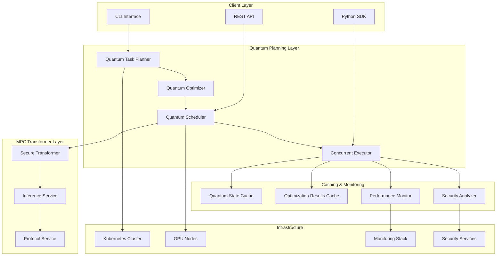

# Quantum-Inspired Task Planning Deployment Guide

## Overview

This guide provides comprehensive deployment instructions for the quantum-inspired task planning system integrated with secure MPC transformer inference.

## Architecture Overview



## Prerequisites

### Hardware Requirements

#### Minimum Requirements
- **CPU**: 8 cores (Intel Xeon or AMD EPYC)
- **Memory**: 32GB RAM
- **Storage**: 500GB SSD
- **Network**: 1Gbps connectivity

#### Recommended Requirements  
- **CPU**: 16+ cores (Intel Xeon Gold or AMD EPYC)
- **Memory**: 128GB+ RAM
- **GPU**: NVIDIA A100 or RTX 4090 (24GB+ VRAM)
- **Storage**: 2TB+ NVMe SSD
- **Network**: 10Gbps connectivity

#### Production Requirements
- **CPU**: 32+ cores across multiple nodes
- **Memory**: 256GB+ RAM per node
- **GPU**: Multiple NVIDIA A100s or H100s
- **Storage**: 10TB+ distributed storage
- **Network**: 25Gbps+ with RDMA support

### Software Requirements

- **Kubernetes**: v1.25+
- **Docker**: v24.0+
- **Python**: 3.10+
- **CUDA**: 12.0+ (for GPU acceleration)
- **Helm**: v3.10+
- **Prometheus**: v2.40+
- **Grafana**: v9.0+

## Installation Methods

### Method 1: Kubernetes Deployment (Recommended)

#### 1. Prepare Kubernetes Cluster

```bash
# Create namespace
kubectl create namespace quantum-mpc

# Add GPU support (if using NVIDIA GPUs)
kubectl apply -f https://raw.githubusercontent.com/NVIDIA/k8s-device-plugin/v0.14.0/nvidia-device-plugin.yml

# Create resource quotas
kubectl apply -f - <<EOF
apiVersion: v1
kind: ResourceQuota
metadata:
  name: quantum-mpc-quota
  namespace: quantum-mpc
spec:
  hard:
    requests.cpu: "32"
    requests.memory: 128Gi
    requests.nvidia.com/gpu: "4"
    limits.cpu: "64" 
    limits.memory: 256Gi
    limits.nvidia.com/gpu: "8"
EOF
```

#### 2. Configure Secrets

```bash
# Create secrets for secure configuration
kubectl create secret generic quantum-mpc-secrets \
  --from-literal=security-key=$(openssl rand -base64 32) \
  --from-literal=cache-encryption-key=$(openssl rand -base64 32) \
  --from-literal=monitoring-token=$(openssl rand -hex 16) \
  --namespace quantum-mpc

# Create TLS certificates
kubectl create secret tls quantum-mpc-tls \
  --cert=path/to/cert.pem \
  --key=path/to/key.pem \
  --namespace quantum-mpc
```

#### 3. Deploy with Helm

```bash
# Add Helm repository
helm repo add quantum-mpc https://charts.quantum-mpc.org
helm repo update

# Install with custom values
helm install quantum-mpc quantum-mpc/secure-mpc-transformer \
  --namespace quantum-mpc \
  --values quantum-planning-values.yaml \
  --wait --timeout 10m
```

#### 4. Custom Helm Values (`quantum-planning-values.yaml`)

```yaml
# Quantum Planning Configuration
quantumPlanning:
  enabled: true
  
  planner:
    maxParallelTasks: 16
    quantumAnnealingSteps: 1000
    optimizationRounds: 100
    gpuAcceleration: true
    
  scheduler:
    maxConcurrentTasks: 8
    quantumOptimization: true
    performanceMonitoring: true
    autoScaling: true
    resourceLimits:
      cpu: "1.0"
      memory: "1.0"
      gpu: "1.0"
      
  executor:
    maxWorkers: 12
    loadBalanceStrategy: "quantum_aware"
    enableGpuAcceleration: true
    autoScaling: true
    
  caching:
    quantumStateCache:
      maxSize: 2000
      maxMemoryMb: 1024
      policy: "adaptive"
      enableCompression: true
      
    optimizationCache:
      maxEntries: 1000
      ttlHours: 24
      
    persistentCache:
      enabled: true
      storageClass: "fast-ssd"
      size: "100Gi"
      
  monitoring:
    enabled: true
    metricsRetention: "30d"
    alerting: true
    prometheus:
      enabled: true
      storageClass: "fast-ssd"
      retention: "30d"
      resources:
        requests:
          cpu: "1"
          memory: "2Gi"
        limits:
          cpu: "2"
          memory: "4Gi"
          
  security:
    analyzer:
      enabled: true
      securityLevel: 128
      continuousMonitoring: true
      
    threatDetection:
      timingAttacks: true
      cacheAnalysis: true
      quantumStateValidation: true
      
# Resource Configuration
resources:
  quantumPlanner:
    requests:
      cpu: "2"
      memory: "4Gi"
    limits:
      cpu: "4"
      memory: "8Gi"
      
  quantumScheduler:
    requests:
      cpu: "4"
      memory: "8Gi"
      nvidia.com/gpu: "1"
    limits:
      cpu: "8"
      memory: "16Gi"
      nvidia.com/gpu: "2"
      
  concurrentExecutor:
    requests:
      cpu: "8"
      memory: "16Gi" 
      nvidia.com/gpu: "2"
    limits:
      cpu: "16"
      memory: "32Gi"
      nvidia.com/gpu: "4"

# Auto-scaling Configuration
autoscaling:
  enabled: true
  minReplicas: 2
  maxReplicas: 10
  targetCPUUtilizationPercentage: 70
  targetMemoryUtilizationPercentage: 80
  
  behavior:
    scaleDown:
      stabilizationWindowSeconds: 300
      policies:
      - type: Percent
        value: 10
        periodSeconds: 60
    scaleUp:
      stabilizationWindowSeconds: 60
      policies:
      - type: Percent
        value: 50
        periodSeconds: 60
        
# Persistent Storage
persistence:
  enabled: true
  storageClass: "fast-ssd"
  accessMode: ReadWriteOnce
  
  quantumCache:
    size: "100Gi"
  optimizationCache:
    size: "50Gi"
  monitoring:
    size: "200Gi"
    
# Network Configuration
networking:
  type: ClusterIP
  port: 8080
  targetPort: 8080
  
  ingress:
    enabled: true
    className: "nginx"
    annotations:
      nginx.ingress.kubernetes.io/ssl-redirect: "true"
      nginx.ingress.kubernetes.io/force-ssl-redirect: "true"
      cert-manager.io/cluster-issuer: "letsencrypt-prod"
    hosts:
      - host: quantum-mpc.example.com
        paths:
          - path: /
            pathType: Prefix
    tls:
      - secretName: quantum-mpc-tls
        hosts:
          - quantum-mpc.example.com
          
# Monitoring & Observability
monitoring:
  prometheus:
    enabled: true
    retention: "30d"
    scrapeInterval: "30s"
    
  grafana:
    enabled: true
    adminPassword: "secure-password"
    persistence:
      enabled: true
      size: "10Gi"
      
  alertmanager:
    enabled: true
    config:
      global:
        smtp_smarthost: 'localhost:587'
      route:
        group_by: ['alertname']
        group_wait: 10s
        group_interval: 10s
        repeat_interval: 1h
        receiver: 'web.hook'
      receivers:
      - name: 'web.hook'
        webhook_configs:
        - url: 'http://webhook-service/alerts'
          
# Security Configuration
security:
  podSecurityPolicy:
    enabled: true
    
  networkPolicy:
    enabled: true
    
  rbac:
    enabled: true
    
  serviceAccount:
    create: true
    annotations: {}
    
  securityContext:
    runAsNonRoot: true
    runAsUser: 1000
    fsGroup: 1000
```

### Method 2: Docker Compose (Development/Testing)

#### 1. Docker Compose Configuration

```yaml
# docker-compose.quantum-planning.yml
version: '3.8'

services:
  quantum-mpc-transformer:
    image: securempc/transformer-inference:latest-quantum
    container_name: quantum-mpc-transformer
    environment:
      - QUANTUM_PLANNING_ENABLED=true
      - MAX_PARALLEL_TASKS=8
      - QUANTUM_OPTIMIZATION=true
      - GPU_ACCELERATION=true
      - SECURITY_LEVEL=128
    volumes:
      - quantum_cache:/app/cache
      - ./config:/app/config:ro
    ports:
      - "8080:8080"
      - "9090:9090"  # Metrics
    deploy:
      resources:
        reservations:
          devices:
            - driver: nvidia
              count: 1
              capabilities: [gpu]
    depends_on:
      - redis
      - prometheus
      
  quantum-scheduler:
    image: securempc/quantum-scheduler:latest
    container_name: quantum-scheduler
    environment:
      - MAX_CONCURRENT_TASKS=6
      - LOAD_BALANCE_STRATEGY=quantum_aware
      - AUTO_SCALING=true
    volumes:
      - ./config:/app/config:ro
    depends_on:
      - quantum-mpc-transformer
      
  redis:
    image: redis:7-alpine
    container_name: quantum-redis
    command: redis-server --appendonly yes --requirepass ${REDIS_PASSWORD}
    volumes:
      - redis_data:/data
    ports:
      - "6379:6379"
      
  prometheus:
    image: prom/prometheus:latest
    container_name: quantum-prometheus
    volumes:
      - ./monitoring/prometheus.yml:/etc/prometheus/prometheus.yml:ro
      - prometheus_data:/prometheus
    ports:
      - "9091:9090"
    command:
      - '--config.file=/etc/prometheus/prometheus.yml'
      - '--storage.tsdb.path=/prometheus'
      - '--web.console.libraries=/usr/share/prometheus/console_libraries'
      - '--web.console.templates=/usr/share/prometheus/consoles'
      
  grafana:
    image: grafana/grafana:latest
    container_name: quantum-grafana
    environment:
      - GF_SECURITY_ADMIN_PASSWORD=${GRAFANA_PASSWORD}
    volumes:
      - grafana_data:/var/lib/grafana
      - ./monitoring/grafana/dashboards:/etc/grafana/provisioning/dashboards:ro
      - ./monitoring/grafana/datasources:/etc/grafana/provisioning/datasources:ro
    ports:
      - "3000:3000"
    depends_on:
      - prometheus

volumes:
  quantum_cache:
  redis_data:
  prometheus_data:
  grafana_data:
```

#### 2. Environment Configuration

```bash
# .env file
REDIS_PASSWORD=your_secure_redis_password
GRAFANA_PASSWORD=your_secure_grafana_password
QUANTUM_SECURITY_KEY=your_quantum_security_key
CACHE_ENCRYPTION_KEY=your_cache_encryption_key
```

### Method 3: Standalone Installation

#### 1. System Preparation

```bash
# Install system dependencies
sudo apt-get update
sudo apt-get install -y python3.10 python3.10-venv python3.10-dev
sudo apt-get install -y build-essential cmake ninja-build
sudo apt-get install -y libssl-dev libffi-dev

# Install CUDA (for GPU support)
wget https://developer.download.nvidia.com/compute/cuda/12.0.0/local_installers/cuda_12.0.0_525.60.13_linux.run
sudo sh cuda_12.0.0_525.60.13_linux.run
```

#### 2. Application Installation

```bash
# Clone repository
git clone https://github.com/your-org/secure-mpc-transformer.git
cd secure-mpc-transformer

# Create virtual environment
python3.10 -m venv quantum-mpc-env
source quantum-mpc-env/bin/activate

# Install dependencies
pip install -e ".[gpu,quantum-planning]"

# Configure environment
cp config/quantum-planning.example.yaml config/quantum-planning.yaml
# Edit configuration as needed

# Run application
python -m secure_mpc_transformer.cli serve \
  --config config/quantum-planning.yaml \
  --host 0.0.0.0 \
  --port 8080
```

## Configuration Options

### Quantum Planning Configuration

```yaml
# config/quantum-planning.yaml
quantum_planning:
  # Core planner settings
  planner:
    max_parallel_tasks: 16
    quantum_annealing_steps: 1000
    temperature_decay: 0.95
    optimization_rounds: 100
    enable_gpu_acceleration: true
    cache_quantum_states: true
    
  # Scheduler configuration
  scheduler:
    max_concurrent_tasks: 8
    task_timeout: 300.0
    retry_attempts: 3
    enable_adaptive_scheduling: true
    quantum_optimization: true
    performance_monitoring: true
    auto_scaling: true
    resource_limits:
      cpu: 1.0
      memory: 1.0
      gpu: 1.0
      
  # Concurrent executor settings
  executor:
    max_workers: 12
    load_balance_strategy: "quantum_aware"  # round_robin, least_loaded, quantum_aware, resource_based
    enable_gpu_acceleration: true
    auto_scaling: true
    scale_up_threshold: 0.8
    scale_down_threshold: 0.3
    min_workers: 2
    
  # Caching configuration
  caching:
    quantum_state_cache:
      max_size: 2000
      max_memory_mb: 1024
      policy: "adaptive"  # lru, lfu, ttl, adaptive
      enable_compression: true
      similarity_threshold: 0.95
      
    optimization_cache:
      max_entries: 1000
      ttl_hours: 24.0
      
    persistent_cache:
      enabled: true
      cache_dir: "/var/lib/quantum-mpc/cache"
      max_size_gb: 10.0
      
  # Performance monitoring
  monitoring:
    enabled: true
    metrics_buffer_size: 10000
    alert_thresholds:
      quantum_coherence_min: 0.1
      optimization_time_max: 30.0
      convergence_rate_min: 0.5
      memory_usage_max: 0.9
      error_rate_max: 0.05
      
  # Security settings
  security:
    analyzer:
      enabled: true
      security_level: 128
      continuous_monitoring: true
      timing_attack_detection: true
      cache_analysis: true
      quantum_state_validation: true
      
    threat_detection:
      enabled: true
      threshold_factor: 3.0
      pattern_analysis: true
      
# MPC Configuration
mpc:
  protocol: "aby3"  # aby3, malicious_3pc, semi_honest_3pc
  security_level: 128
  parties: 3
  gpu_acceleration: true
  
# Infrastructure settings
infrastructure:
  gpu:
    enabled: true
    memory_fraction: 0.9
    device_ids: [0, 1]  # Use specific GPU devices
    
  networking:
    max_connections: 1000
    connection_timeout: 30.0
    keep_alive: true
    
  storage:
    data_dir: "/var/lib/quantum-mpc"
    temp_dir: "/tmp/quantum-mpc" 
    log_dir: "/var/log/quantum-mpc"
```

### Environment Variables

```bash
# Core settings
export QUANTUM_PLANNING_ENABLED=true
export MAX_PARALLEL_TASKS=16
export QUANTUM_OPTIMIZATION=true
export GPU_ACCELERATION=true

# Security
export SECURITY_LEVEL=128
export QUANTUM_SECURITY_KEY="your-secret-key"
export CACHE_ENCRYPTION_KEY="your-cache-key"

# Resource limits
export MAX_MEMORY_MB=8192
export MAX_GPU_MEMORY_FRACTION=0.9
export MAX_CONCURRENT_TASKS=8

# Monitoring
export PROMETHEUS_ENDPOINT="http://prometheus:9090"
export METRICS_ENABLED=true
export ALERT_WEBHOOK_URL="http://alertmanager:9093"

# Caching
export CACHE_DIR="/var/lib/quantum-mpc/cache"
export CACHE_MAX_SIZE_GB=10
export PERSISTENT_CACHE_ENABLED=true
```

## Monitoring & Observability

### Prometheus Metrics

The quantum planning system exposes comprehensive metrics:

```prometheus
# Quantum planning metrics
quantum_tasks_scheduled_total
quantum_tasks_completed_total
quantum_tasks_failed_total
quantum_optimization_time_seconds
quantum_state_coherence_score
quantum_cache_hit_rate
quantum_cache_miss_rate

# Performance metrics
task_execution_time_seconds
worker_utilization_ratio
resource_usage_percent
memory_usage_bytes
gpu_utilization_percent

# Security metrics
security_threats_detected_total
timing_attack_attempts_total
cache_analysis_anomalies_total
quantum_state_validation_failures_total
```

### Grafana Dashboards

Import pre-built dashboards:

```bash
# Import quantum planning dashboard
curl -X POST \
  http://grafana:3000/api/dashboards/db \
  -H 'Content-Type: application/json' \
  -d @monitoring/grafana/dashboards/quantum-planning-overview.json

# Import security dashboard  
curl -X POST \
  http://grafana:3000/api/dashboards/db \
  -H 'Content-Type: application/json' \
  -d @monitoring/grafana/dashboards/quantum-security-analysis.json
```

### Alerting Rules

```yaml
# monitoring/alerts/quantum-planning.yml
groups:
- name: quantum_planning
  rules:
  - alert: QuantumOptimizationTimeout
    expr: quantum_optimization_time_seconds > 60
    for: 5m
    labels:
      severity: warning
    annotations:
      summary: "Quantum optimization taking too long"
      
  - alert: LowQuantumCoherence
    expr: quantum_state_coherence_score < 0.1
    for: 2m
    labels:
      severity: critical
    annotations:
      summary: "Quantum coherence below acceptable threshold"
      
  - alert: HighTaskFailureRate
    expr: rate(quantum_tasks_failed_total[5m]) / rate(quantum_tasks_scheduled_total[5m]) > 0.1
    for: 5m
    labels:
      severity: warning
    annotations:
      summary: "High task failure rate detected"
      
  - alert: SecurityThreatDetected
    expr: increase(security_threats_detected_total[1m]) > 0
    for: 0s
    labels:
      severity: critical
    annotations:
      summary: "Security threat detected in quantum planning system"
```

## Performance Tuning

### GPU Optimization

```yaml
# Optimize for NVIDIA A100
gpu_optimization:
  device_type: "a100"
  memory_pool_size: "20GB"
  stream_count: 8
  kernel_optimization: true
  tensor_cores: true
  mixed_precision: true
  
# Optimize for RTX 4090
gpu_optimization:
  device_type: "rtx4090" 
  memory_pool_size: "22GB"
  stream_count: 4
  kernel_optimization: true
  tensor_cores: true
  mixed_precision: false
```

### CPU Optimization

```yaml
cpu_optimization:
  numa_aware: true
  thread_affinity: true
  cpu_isolation: [8, 9, 10, 11, 12, 13, 14, 15]  # Isolate CPUs for quantum computation
  memory_hugepages: true
  jemalloc: true
```

### Memory Optimization

```yaml
memory_optimization:
  quantum_cache_prealloc: true
  memory_mapping: true
  garbage_collection:
    frequency: "adaptive"
    threshold: 0.8
  swap_disabled: true
```

## Security Hardening

### Network Security

```yaml
network_security:
  tls:
    min_version: "1.3"
    cipher_suites: ["ECDHE-ECDSA-AES256-GCM-SHA384"]
    certificates:
      cert_file: "/etc/ssl/certs/quantum-mpc.crt"
      key_file: "/etc/ssl/private/quantum-mpc.key"
      
  firewall:
    ingress_rules:
      - port: 8080
        protocol: tcp
        source: "10.0.0.0/8"
      - port: 9090
        protocol: tcp
        source: "monitoring-subnet"
        
  rate_limiting:
    requests_per_second: 100
    burst_size: 200
    
  authentication:
    type: "jwt"
    secret_key: "${JWT_SECRET_KEY}"
    expiration: "1h"
```

### Data Security

```yaml
data_security:
  encryption:
    at_rest:
      algorithm: "AES-256-GCM"
      key_rotation: "24h"
    in_transit:
      tls_version: "1.3"
      certificate_validation: true
      
  access_control:
    rbac: true
    api_keys: true
    audit_logging: true
    
  quantum_state_protection:
    integrity_checks: true
    tamper_detection: true
    secure_deletion: true
```

## Troubleshooting

### Common Issues

#### 1. GPU Memory Issues

```bash
# Check GPU memory usage
nvidia-smi

# Clear GPU cache
python -c "
import torch
if torch.cuda.is_available():
    torch.cuda.empty_cache()
    print('GPU cache cleared')
"

# Reduce batch size or cache size in configuration
```

#### 2. Quantum State Validation Failures

```bash
# Enable debug logging
export QUANTUM_DEBUG=true
export LOG_LEVEL=DEBUG

# Check quantum state metrics
curl http://localhost:9090/metrics | grep quantum_state

# Verify quantum state normalization
python -c "
from secure_mpc_transformer.planning import QuantumSecurityAnalyzer
analyzer = QuantumSecurityAnalyzer()
# Check specific quantum states
"
```

#### 3. Performance Issues

```bash
# Profile quantum optimization
python -m cProfile -o quantum_profile.prof \
  -m secure_mpc_transformer.planning.optimization

# Analyze bottlenecks
python -c "
import pstats
stats = pstats.Stats('quantum_profile.prof')
stats.sort_stats('cumulative').print_stats(20)
"

# Monitor resource usage
htop
iostat -x 1
```

#### 4. Security Alerts

```bash
# Check security logs
tail -f /var/log/quantum-mpc/security.log

# Run security analysis
python -m secure_mpc_transformer.planning.security \
  --analyze-system \
  --generate-report

# Check for timing attacks
curl http://localhost:9090/metrics | grep timing_attack
```

### Debugging Tools

```bash
# Enable comprehensive debugging
export QUANTUM_PLANNING_DEBUG=true
export SECURITY_ANALYSIS_DEBUG=true
export CACHE_DEBUG=true

# Start with debug server
python -m secure_mpc_transformer.cli serve \
  --debug \
  --log-level DEBUG \
  --profile
```

## Backup & Recovery

### Backup Strategy

```bash
#!/bin/bash
# backup-quantum-mpc.sh

BACKUP_DIR="/backup/quantum-mpc/$(date +%Y%m%d_%H%M%S)"
mkdir -p $BACKUP_DIR

# Backup quantum cache
cp -r /var/lib/quantum-mpc/cache $BACKUP_DIR/

# Backup configuration
cp -r /etc/quantum-mpc $BACKUP_DIR/

# Backup monitoring data
kubectl exec -n quantum-mpc prometheus-0 -- \
  tar czf - /prometheus | cat > $BACKUP_DIR/prometheus.tar.gz

# Backup application data
kubectl get all -n quantum-mpc -o yaml > $BACKUP_DIR/k8s-resources.yaml
```

### Recovery Procedure

```bash
#!/bin/bash
# restore-quantum-mpc.sh

BACKUP_DIR=$1

# Restore configuration
cp -r $BACKUP_DIR/quantum-mpc /etc/

# Restore quantum cache
cp -r $BACKUP_DIR/cache /var/lib/quantum-mpc/

# Redeploy application
kubectl apply -f $BACKUP_DIR/k8s-resources.yaml

# Restart services
kubectl rollout restart deployment/quantum-mpc-transformer -n quantum-mpc
```

## Support & Maintenance

### Health Checks

```bash
# System health check
curl http://localhost:8080/health

# Quantum planning health
curl http://localhost:8080/quantum/health

# Security status
curl http://localhost:8080/security/status
```

### Log Management

```bash
# View quantum planning logs
kubectl logs -f deployment/quantum-mpc-transformer -n quantum-mpc

# Search security logs
grep "SECURITY" /var/log/quantum-mpc/*.log

# Monitor performance logs
tail -f /var/log/quantum-mpc/performance.log
```

### Updates & Patches

```bash
# Update quantum planning system
helm upgrade quantum-mpc quantum-mpc/secure-mpc-transformer \
  --namespace quantum-mpc \
  --values quantum-planning-values.yaml

# Rolling update
kubectl set image deployment/quantum-mpc-transformer \
  quantum-mpc-transformer=securempc/transformer-inference:v2.1.0 \
  -n quantum-mpc
```

This deployment guide provides comprehensive instructions for deploying the quantum-inspired task planning system in production environments with proper security, monitoring, and operational considerations.